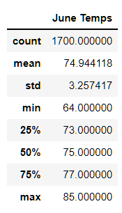
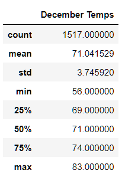

# Surfs-Up: A Business Analysis
## Overview
The purpose of the analysis is to determine if a surf board rental and ice cream shop is sustainable throughout the year on the island of Oahu. Specifically, weather data in the months of June and December between 2010 and 2017 are analyzed for temperature variances and if temperature statistics in those two months are comparable.

## Results
Two deliverables were created to analyze the data, including
- Temperature readings during the month of June
- Temperature readings during the month of December

### June Statistics
In the month of June, temperatures recorded range from a minimum of 64&deg;F to a maximum of 85&deg;F, or a range of 21&deg;F for the month. The mean is 75&deg;F, and the median is 75&deg;F.

### December Statistics
In the month of December, temperatures recorded range from a minimum of 56&deg;F to a maximum of 83&deg;F, or a range of 27&deg;F for the month. The mean is 71&deg;F, and the median is 71&deg;F.

## Summary

